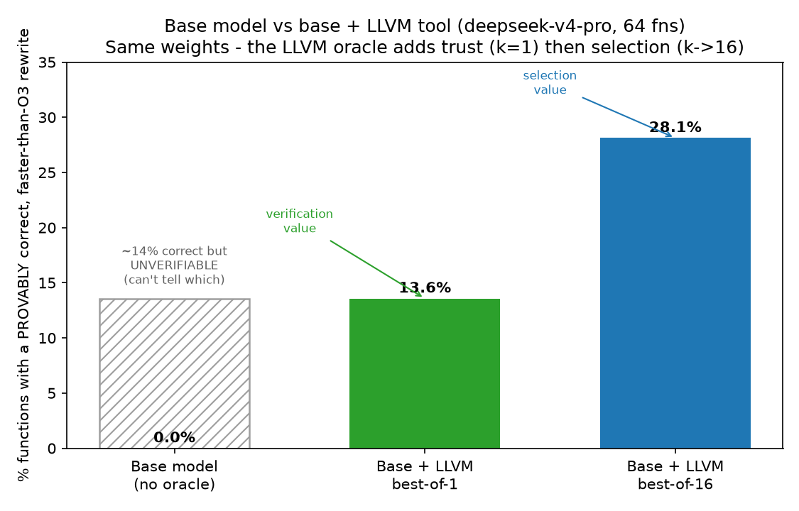
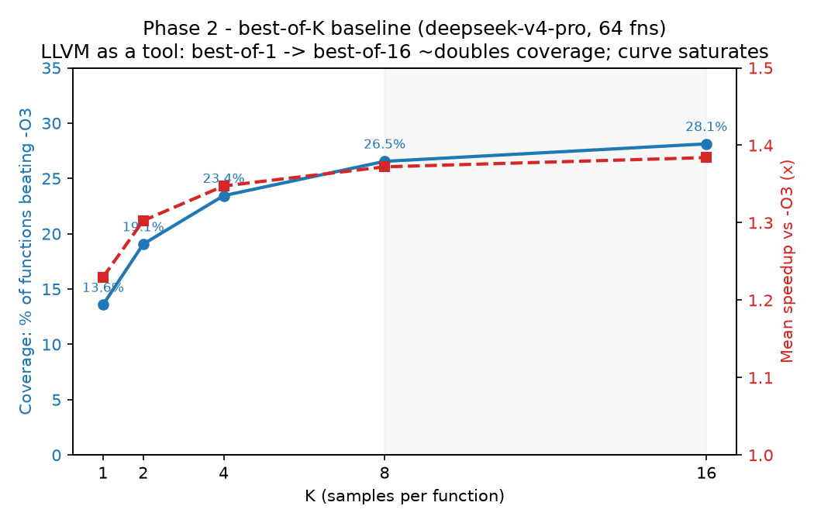
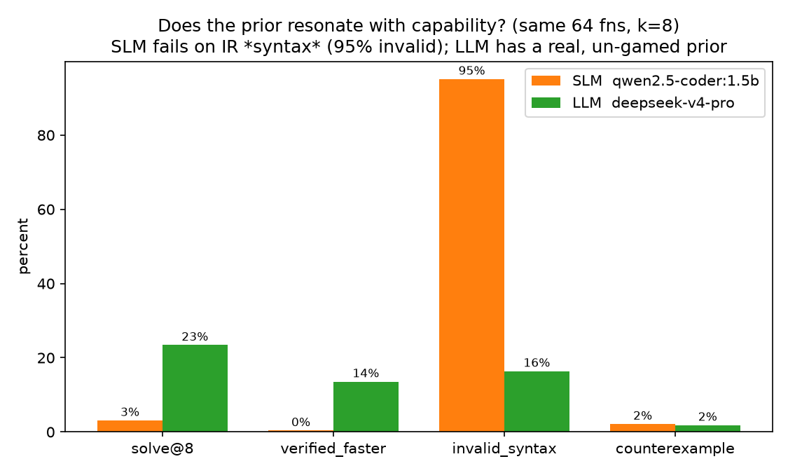
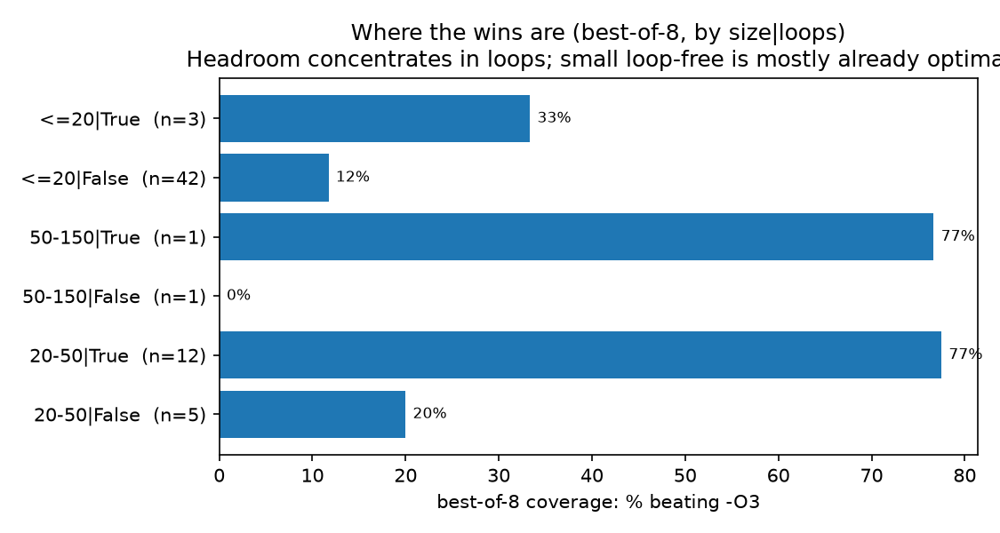

# Phase 2 — Best-of-K Inference-Time Baseline — Findings

**Date:** 2026-07-19 · **Model:** `deepseek-v4-pro` (Fireworks) · **Oracle:** Alive2 v21 + LLVM 21 ·
**Corpus:** 64 clean single functions (`corpus21`, llvm@21-compiled, O0+O3+mca baselines).

## What this is

Phase 2 establishes the **non-TTRL baseline**: sample K rewrites per function, keep the
Alive2-**verified** ones, select the **fastest** by llvm-mca, and measure the achieved speedup over
the compiler's `-O3`. This is the number a Phase 3 TTRL loop must beat, and — per the master plan —
"the pipeline becomes the RL reward function unchanged." It is also the **first measurement of LLVM
*improving* the result** (via selection), not merely grading it.

Metrics (unbiased estimators over all C(n,k) subsets, not "first k"):
- **Coverage@K** = fraction of functions whose best-of-K beats `-O3` (has a verified-faster rewrite).
- **MeanSpeedup@K** = mean achieved speedup over `-O3`, `max(1.0, best verified speedup)` per
  function (you keep `-O3` when the model can't beat it).

## The baseline (best-of-K, overall)

From a single K=16 `deepseek-v4-pro` run (64 functions):

| K | Coverage (beat -O3) | Mean speedup vs -O3 |
|--:|--:|--:|
| 1 | 13.6% | 1.23× |
| 2 | 19.1% | 1.30× |
| 4 | 23.4% | 1.35× |
| 8 | 26.5% | 1.37× |
| 16 | **28.1%** | **1.38×** |

Both metrics rise monotonically with K but **saturate**: K=8→16 gains almost nothing (26.5%→28.1%
coverage, 1.37×→1.38× speedup). **Best-of-K tops out around 28% coverage / 1.38× over `-O3`** — a
clean, non-runaway target. That matters: a strong best-of-K baseline that *saturated* leaves
well-defined headroom for TTRL to beat by making the base model itself produce more verified-faster
rewrites, rather than the baseline running away with more samples.

### Per bucket (K=8)
- **≤20 loop-free** (n=42): coverage 11.9%, speedup 1.03× — the hard, common case; small straight-line
  functions leave little for the model to improve over `-O3`.
- **20–50 loops** (n=12): coverage 75%, speedup 2.02× — the model shines on small loops (these are
  simple counted loops Alive2 can also verify).
- **≤20 loops** (n=3): coverage 33%, speedup 4.5× — few functions, but large wins when found.
- **50–150 loop-free** (n=1): 0% — one function, no improvement found.

The gains concentrate where there's headroom (loops, larger bodies); tiny loop-free functions are
mostly already optimal at `-O3`.

## Did LLVM improve the result over the base model? (the question that motivated Phase 2)

Yes — via **selection**, quantifiably:

- **Without the oracle:** you have raw model samples you **cannot verify or rank** — no trustworthy
  output at all. That's the true "without LLVM" baseline: zero guaranteed-correct speedups.
- **With the oracle, best-of-1** (single verified sample): coverage 13.6%, mean 1.23×.
- **With the oracle, best-of-16** (verify + select fastest): coverage **28.1%** (~2× more functions),
  mean **1.38×**.

So the Alive2+mca selection layer roughly **doubles coverage** from K=1→16 and lifts mean speedup —
purely by picking the proven-correct-and-fastest rewrite. This is the inference-time value of the
LLVM oracle, with **zero training**.

## What TTRL (Phase 3) must beat

**Best-of-K at the K the RL loop samples** (e.g. best-of-16 = 28.1% coverage / 1.38× speedup). TTRL's
job is to make the *base model itself* produce more verified-faster rewrites, so that at equal K it
clears this bar — ideally shifting the whole K-curve up. If TTRL only matches best-of-K, it isn't
worth the training cost; the curve here is the yardstick.

## Figures

Regenerate with `uv run --with matplotlib --with numpy python scripts/make_plots.py`.

- **Best-of-K baseline** — `docs/figures/plot1_bestofk_curve.png` (coverage + mean speedup vs K;
  the "LLVM as a tool" result: best-of-1 → best-of-16 ~doubles coverage, curve saturates).
- **SLM vs LLM prior** — `docs/figures/plot2_slm_vs_llm.png` (capability resonance; SLM fails on IR
  syntax, LLM has a real un-gamed prior).
- **Coverage by bucket** — `docs/figures/plot3_coverage_by_bucket.png` (where the headroom is).

- **Base model vs base + LLVM** — `docs/figures/plot4_base_vs_llm_tool.png` (the direct answer:
  base alone ships 0% *trustworthy* speedups since it can't verify; the oracle adds *trust* at k=1
  then *selection* to k=16 → 28.1%).






## Caveats (carried from Phase 1)

- **Small, trivial corpus** (64 functions, several buckets n=1). Directional, not final — a
  calibrated realistic corpus (loopy/larger, on a Linux box) would firm these numbers.
- **llvm-mca is a proxy** for speed (reliable loop-free, weaker on loops; cycles ≠ wall-clock).
  A speed-metric validation vs real timing is the recommended next hardening — a reviewer-critical
  point for any paper.
- **Format-A (raw IR) only**, one frontier model. The K-curve is deepseek-specific.

## Reproduce

```bash
# free curve from an existing run:
uv run python -m probe.phase2_baseline --rewrites results/probe_llm_deepseek \
    --corpus /tmp/corpus21.jsonl --ks 1,2,4,8
# firm K=16 curve (needs env + key):
source scripts/alive2/env.sh; export FIREWORKS_API_KEY=<key>
uv run python -m probe.run_probe --corpus /tmp/corpus21.jsonl --backend api \
    --model accounts/fireworks/models/deepseek-v4-pro \
    --base-url https://api.fireworks.ai/inference/v1 --api-key-env FIREWORKS_API_KEY \
    --format ir --k 16 --verifier alive --perf mca --out results/probe_llm_deepseek_k16
uv run python -m probe.phase2_baseline --rewrites results/probe_llm_deepseek_k16 \
    --corpus /tmp/corpus21.jsonl --ks 1,2,4,8,16
```
