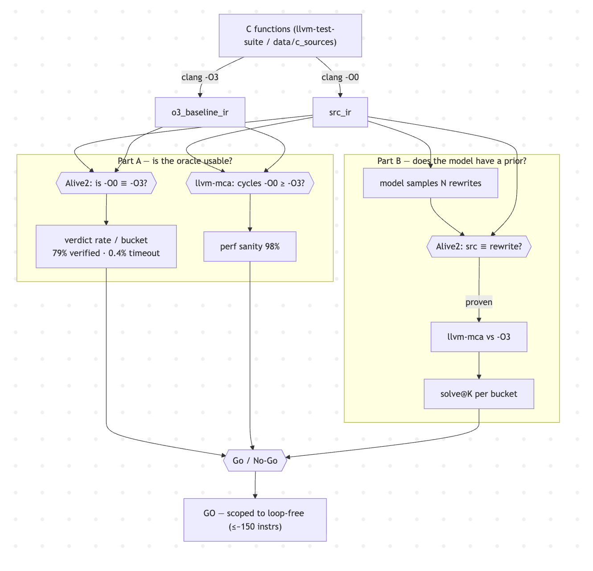
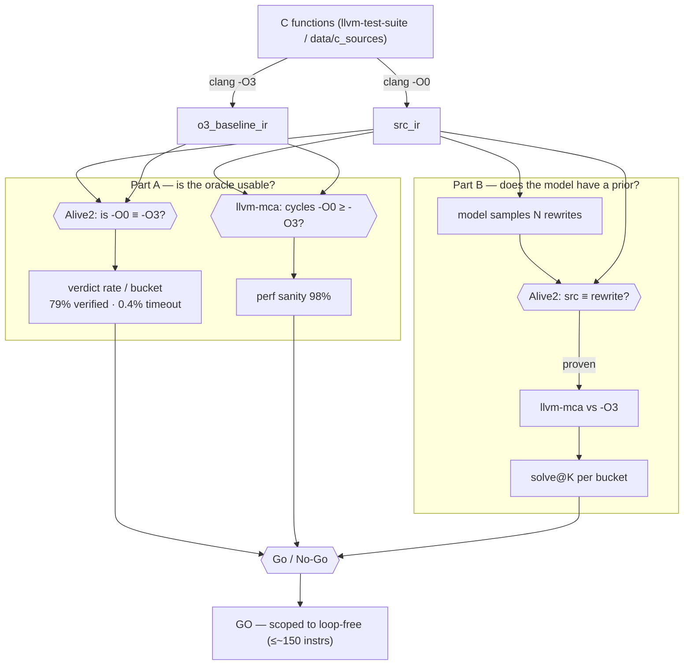
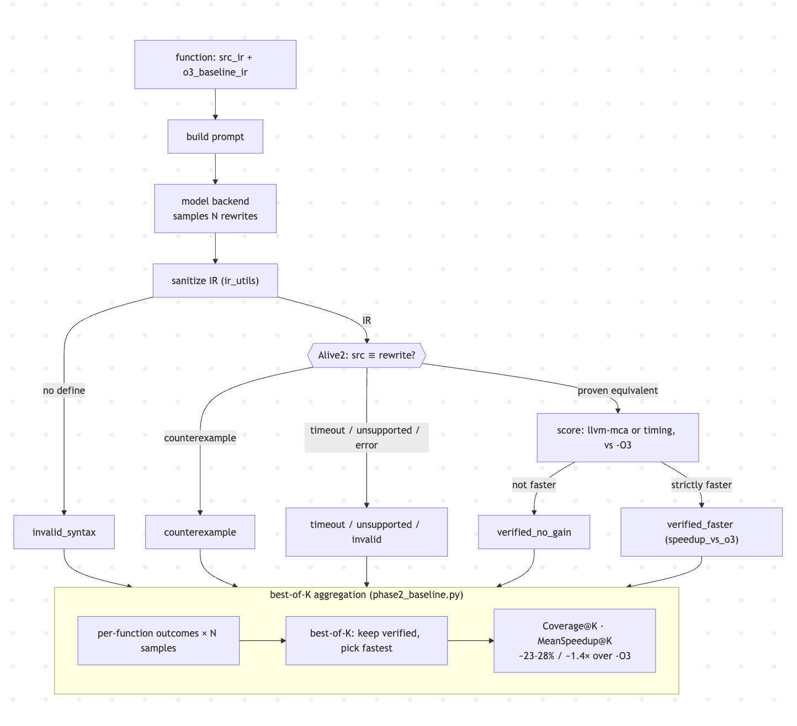
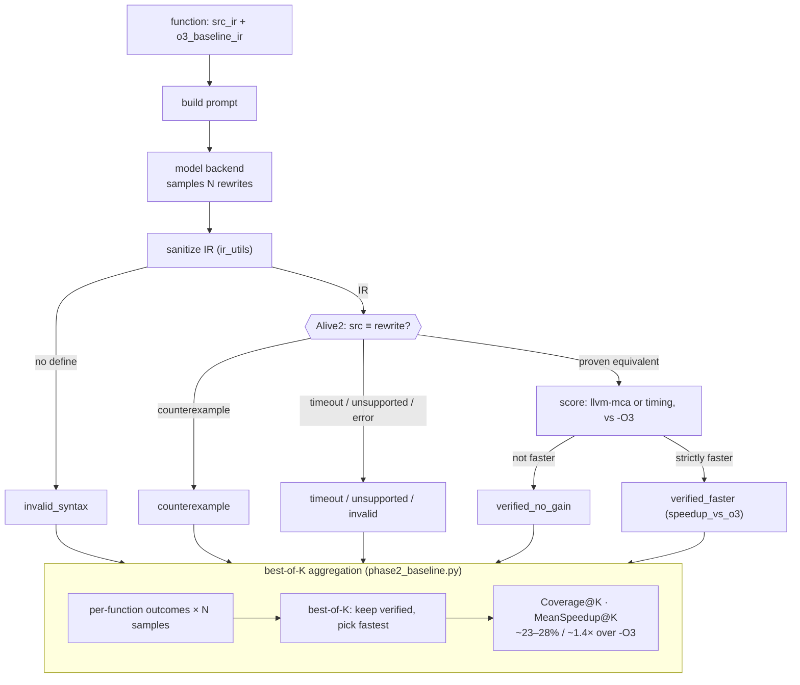

# Pipeline diagrams

Open this in a Markdown preview (IDE or GitHub) to see the diagrams rendered.

The reward pipeline (the box that classifies one rewrite) is **the same** in both phases: Phase 1
uses it to *grade*, Phase 2 adds a best-of-K *selection* layer on top, and Phase 3 will wrap an RL
update around it — nothing inside the box changes.

## Phase 1 — Viability

## Phase 2 — Best-of-K inference-time baseline

